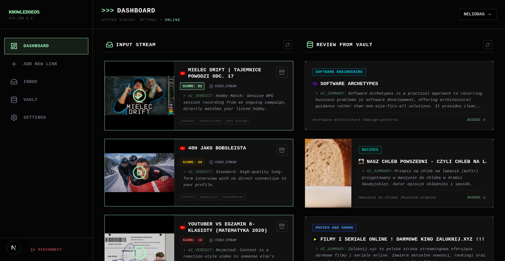
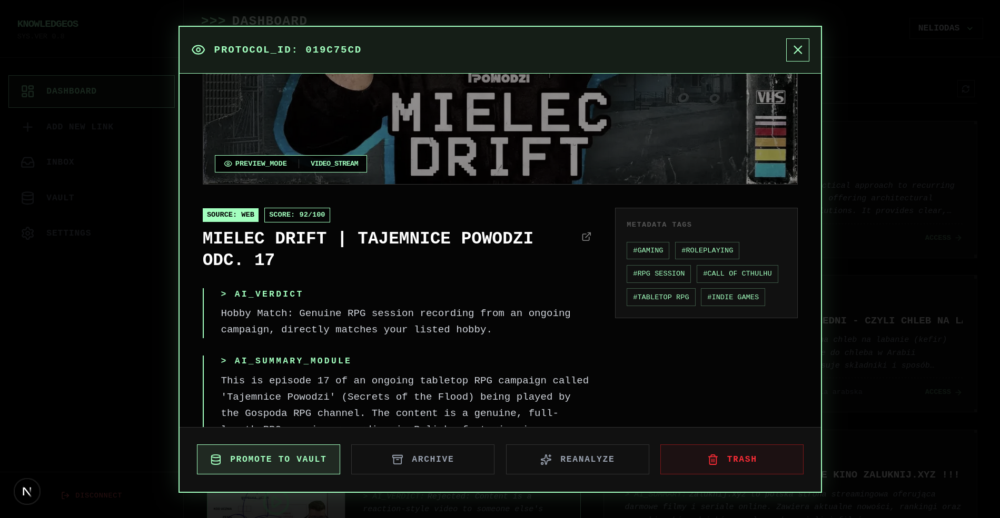
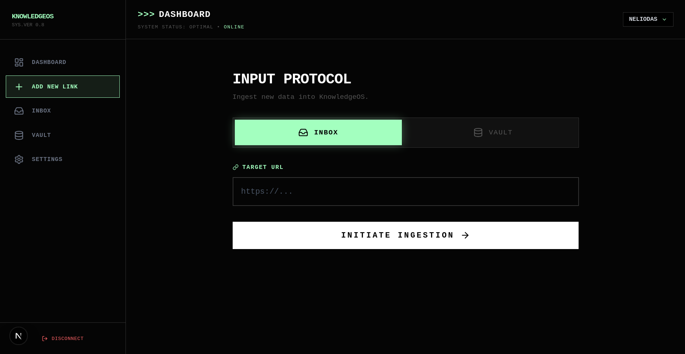
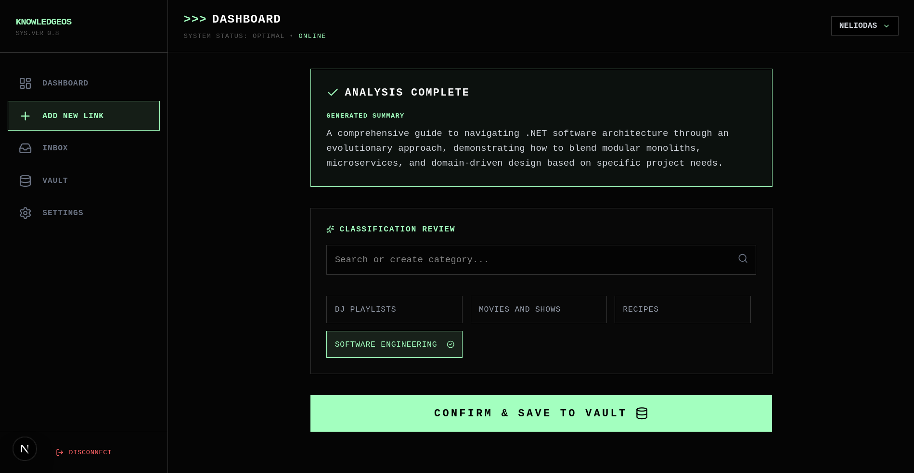
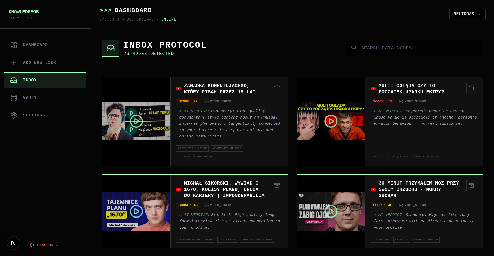
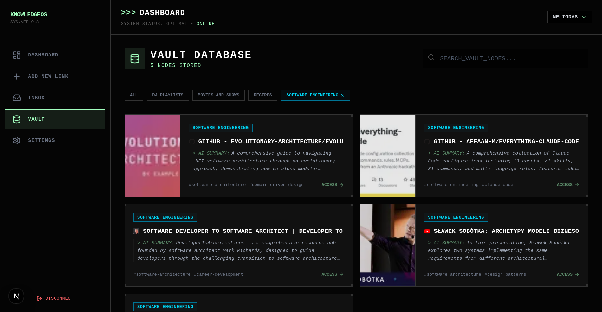
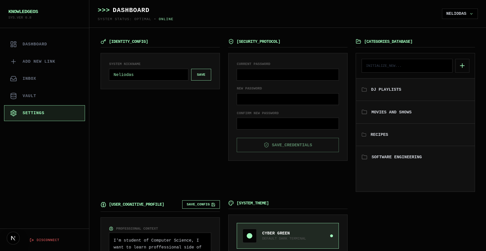

<div align="center">

# 🧠 KnowledgeOS

**Your personal AI-powered knowledge management system.**  
Save anything from the web. Let AI score, summarize, and organize it — based on *your* profile, not generic algorithms.


</div>

---

## 📖 What is KnowledgeOS?

KnowledgeOS is a self-hosted knowledge vault — a place where everything you find on the internet lands, gets evaluated by AI, and either gets archived or filtered out.

Instead of mindlessly saving bookmarks you never revisit, KnowledgeOS uses a **personalized AI scoring pipeline** to decide how relevant each piece of content is *to you* — based on your hobbies, professional context, and learning goals.

### Core flow

```
URL saved by user
      │
      ▼
[Ingestion Job] ──► Fetch metadata (title, image, description)
      │               YouTube API / Reddit JSON / OpenGraph
      ▼
[AI Analysis Job] ──► Score 0–100, verdict, summary, tags
      │                Based on your personal profile
      ▼
[Inbox] ──► Review ──► [Vault] (permanent archive)
                  └──► [Trash]
```

---

## ✨ Features

### 🤖 AI-Powered Inbox
- Every saved resource is scored **0–100** based on your personal profile
- AI generates a **verdict**, **summary**, and **tags**
- Scoring uses a two-axis system: **Intrinsic Quality** × **Relevance to your profile**
- Protects against keyword hallucination — "AI" in title ≠ match if content is a gimmick

### 📥 Inbox & 🏛️ Vault
- **Inbox** — staging area for new resources, shows AI score and verdict
- **Vault** — permanent curated archive with categories, notes, and detailed AI summaries
- One-click promotion from Inbox → Vault with automatic re-analysis
- Smart Mix — surfaces forgotten Vault items across different categories

### 🌐 Multi-source ingestion
| Source | What gets fetched |
|--------|------------------|
| **YouTube** | Title, channel, duration, views, transcript excerpt |
| **Articles / Websites** | Title, description, author, `og:image`, favicon fallback |

### 🗂️ Categories & Tags
- User-defined categories for Vault organization
- AI suggests category based on existing ones (or proposes new)
- Auto-tagging with niche, profile-relevant vocabulary

### 👤 User Profile
- `ProfessionalContext` — who you are, what you do
- `LearningGoals` — what you want to learn
- `Hobbies` — your interests (genuinely used for scoring, not decoration)
- `TopicsToAvoid` — hard filter, caps score at 0–10

### ⚙️ Background Jobs
- Hangfire-powered async processing pipeline
- Automatic retry with error recovery job
- `ErrorRecoveryJob` — periodically rescues stuck resources

---

## 🏗️ Architecture

### Backend

```
KnowledgeOS.Backend/
├── Controllers/          # REST API endpoints
├── Services/
│   ├── Ai/               # OpenRouter provider, AI service, prompt builder
│   ├── Content/          # YouTube, Reddit, Website content fetchers
│   ├── Processors/       # Resource processors
│   └── Abstractions/     # Interfaces
├── Jobs/                 # Hangfire background jobs (Ingestion, AI Analysis, Error Recovery)
├── Entities/
│   ├── Resources/        # Resource (base), VideoResource, ArticleResource, RedditResource
│   │   ├── InboxMetadata # AI score, verdict, inbox summary
│   │   └── VaultMetadata # Detailed summary, category, user notes
│   ├── Tagging/          # Tag, Category
│   └── Users/            # ApplicationUser, UserPreference
├── DTOs/                 # Data Transfer Objects
├── Data/                 # AppDbContext, EF Core (TPT strategy)
└── Migrations/           # EF Core migrations
```

### Frontend

```
knowledgeos-frontend/
├── app/
│   ├── (auth)/
│   │   ├── login/        # Login page
│   │   └── register/     # Registration page
│   └── dashboard/
│       ├── inbox/        # Inbox view — scored resources awaiting review
│       ├── vault/        # Vault view — curated archive with filters
│       ├── add/          # Add new resource by URL
│       ├── settings/     # User preferences & account settings
│       └── layout.tsx    # Dashboard shell with navigation
├── components/
│   ├── InboxCard.tsx     # Resource card for inbox (score, verdict, tags)
│   ├── InboxDetailModal.tsx  # Full resource detail view for inbox
│   ├── VaultCard.tsx     # Resource card for vault (category, notes)
│   └── VaultDetailModal.tsx  # Full resource detail view for vault
└── lib/
    ├── api.ts            # All API calls (typed fetch wrappers)
    ├── types.ts          # Shared TypeScript types
    ├── categoryColor.ts  # Category color mapping utility
    └── ThemeProvider.tsx # Dark/light theme context
```

### Key design decisions

- **Table Per Type (TPT)** — `VideoResource`, `ArticleResource`, `RedditResource` each have their own table, sharing the base `Resources` table
- **1:1 Metadata composition** — `InboxMetadata` and `VaultMetadata` are separate tables linked by FK, not flat columns on `Resource`
- **Global query filters** — all queries are automatically scoped to `CurrentUser.UserId`
- **AI provider abstraction** — multiple models registered as `IAiProvider`, `AiService` tries them in order with fallback
- **Next.js App Router** — full server/client component split, JWT stored in `localStorage`, all API calls typed via shared `lib/types.ts`

---

## 🚀 Getting Started

### Docker — full stack (recommended)

The entire stack (PostgreSQL, backend, frontend) is managed by Docker Compose. No separate frontend/backend setup is needed.

1. **Copy and configure the environment file**
   ```bash
   cp .env.example .env
   ```

   Open `.env` and set your values. The most important one is `NEXT_PUBLIC_API_URL` — this is the address the **browser** uses to reach the backend, so it must be your machine's actual IP (not `localhost`) if you want to access it from other devices on the network or expose it externally:

   ```env
   # Local network (phone, tablet, other PC on the same WiFi)
   NEXT_PUBLIC_API_URL=http://192.168.1.100:5000/api
   CORS_ALLOWED_ORIGINS=http://192.168.1.100:3000

   # VPS / public server
   NEXT_PUBLIC_API_URL=https://api.yourdomain.com/api
   CORS_ALLOWED_ORIGINS=https://yourdomain.com

   # Ports (change if you have conflicts)
   FRONTEND_PORT=3000
   BACKEND_PORT=5000

   # Secrets
   JWT_KEY=your_min_32_char_secret_here
   OPENROUTER_API_KEY=sk-or-...
   ```

2. **Run**
   ```bash
   docker compose up -d --build
   ```

   Database migrations are applied **automatically** on backend startup — no extra step needed.

   | Service | Default address |
   |---------|----------------|
   | Frontend | `http://localhost:3000` |
   | Backend API | `http://localhost:5000` |
   | Swagger | `http://localhost:5000/swagger` |
   | Adminer (DB UI) | `http://localhost:8080` |

   > **Tip:** To find your local IP on Linux run `ip route get 1 | awk '{print $7}'`

---

## 🛣️ Roadmap

### 🔧 In Progress

- [ ] **Browser extension** — save to KnowledgeOS directly from any webpage with one click
- [ ] **Extension for Shortcut app for iOS** — add to KnowledgeOS from iPhone share sheet
### 📋 Planned

#### Core Features

- [ ] **PWA (Progressive Web App)** — installable mobile/desktop app with offline support and home screen shortcut
- [ ] **Vector search** — semantic similarity search across saved resources using embeddings
- [ ] **Reddit as a source** — support saving Reddit posts and comments with appropriate metadata and AI analysis

#### AI & Intelligence
- [ ] **AI re-analysis** — manually trigger re-analysis after updating your profile
- [ ] **Duplicate detection** — warn when saving content already in vault (semantic, not just URL match)
- [ ] **Trend surfacing** — detect recurring themes across saved resources

#### Organization
- [ ] **Nested categories** — subcategories for deeper organization
- [ ] **Collections / reading lists** — group resources manually across categories
- [ ] **Resource relations** — link related resources together

#### UX & Settings
- [ ] **Settings page** — manage account, preferences, AI model choice, and danger zone
- [ ] **Admin panel** — user management, job queue monitoring, system health
- [ ] **Password reset via email** — forgot password flow with email token
- [ ] **Email verification** — verify email on registration

#### Integrations
- [ ] **Pocket / Readwise import** — migrate existing bookmarks
- [ ] **Obsidian export** — export vault as Obsidian-compatible Markdown vault
- [ ] **RSS / Atom feed ingestion** — auto-import from feeds

---

## 🖼️ Screenshots









---

## 🧰 Tech Stack

| Layer | Technology |
|-------|-----------|
| **Frontend** | Next.js 16, React 19, TypeScript, Tailwind CSS 4 |
| **Backend** | ASP.NET Core 10, C# |
| **Database** | PostgreSQL + EF Core 10 (TPT) |
| **Auth** | ASP.NET Core Identity + JWT |
| **AI** | OpenRouter API (multi-model with fallback) |
| **Background Jobs** | Hangfire + PostgreSQL storage |
| **Content Fetching** | YoutubeExplode, HtmlAgilityPack, Reddit JSON API |
| **API Docs** | Swagger / OpenAPI |

---

## 📄 License

MIT License — see [LICENSE](LICENSE) for details.

---

<div align="center">
  <sub>Built with curiosity, need and too many saved tabs. Also with a dash of AI (especially frontend ^^)</sub>
</div>
