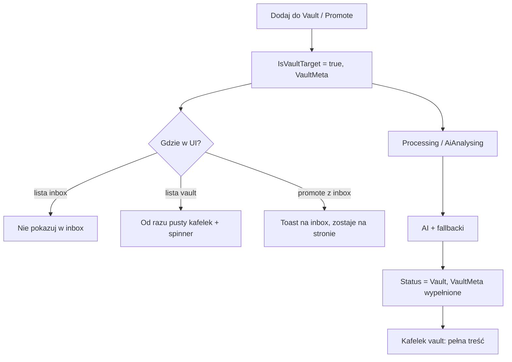

# Vault processing UX — plan implementacji (handoff dla agenta)

**Baza:** `dev`  
**Branch roboczy (jeden na cały feature):** `feat/vault-processing-ux`  
**Status:** do zrobienia — ten dokument jest źródłem prawdy.

```bash
git checkout dev && git pull
git checkout -b feat/vault-processing-ux
# implementacja → PR do dev (nie merge bez review)
```

---

## Problem (stan na `dev`)

| Akcja | Inbox API | Vault API |
|--------|-----------|-----------|
| Dodaj do Vault / Promote | Zwraca zasób w `Processing` / `AiAnalysing` (brak filtra `IsVaultTarget`) | Zwraca **tylko** `Status == Vault` |
| UX | `InboxProcessingIndicator` + polling | Brak kafelka do końca AI |

Użytkownik widzi „mielenie” w inbox, a w vault pusto — niespójne.

**Kluczowe pliki backend:** `ResourceService.cs` (`GetInboxResourcesAsync`, `GetVaultResourcesAsync`, `PromoteToVaultAsync`), `AiAnalysisJob.cs`  
**Kluczowe pliki frontend:** `app/dashboard/inbox/page.tsx`, `app/dashboard/vault/page.tsx`, `VaultCard.tsx`, `InboxCard.tsx`, `lib/categoryColor.ts`, `lib/useInboxAutoRefresh.ts`

---

## Decyzje produktowe (ZABLOKOWANE — nie zmieniać bez usera)

| # | Decyzja |
|---|---------|
| 1 | **Kolory kategorii — Opcja A:** stabilna paleta po `categoryId` (hash GUID), nie po nazwie. Bez migracji DB. |
| 2 | **Po promote:** użytkownik **zostaje na inbox**; krótkie **toast / banner** („Zasób przeniesiony do Vault — analiza w toku”). **Bez** redirectu na `/dashboard/vault`. |
| 3 | **Brak UI „failed” dla vault:** użytkownik **nigdy** nie widzi kafelka błędu AI w vault. Vault-target ma **zawsze** trafić do vault (retry, fallback metadanych, minimalne `VaultMeta` + `Status = Vault`). Nie pokazywać `Error` / „nie udało się” w vault flow. |

---

## Docelowy flow



---

## Faza 1 — Backend (wymagane przed frontendem)

### 1.1 Rozdzielenie zapytań (`ResourceService`)

**Inbox** — tylko zasoby **nie** vault-target:

```csharp
.Where(r => r.UserId == userId
    && !r.IsVaultTarget
    && (r.Status == ResourceStatus.Inbox
        || r.Status == ResourceStatus.Processing
        || r.Status == ResourceStatus.AiAnalysing))
```

Zastosować też w: `GetSmartMixAsync`, `GetInboxResourceByIdAsync` (zwróć `null` jeśli `IsVaultTarget`).

**Vault** — wszystkie vault-target poza koszem/archiwum:

```csharp
.Where(r => r.UserId == userId
    && r.IsVaultTarget
    && r.Status != ResourceStatus.Trash
    && r.Status != ResourceStatus.Archived)
```

Zastosować też w: `GetVaultMixAsync`.

**Uwaga:** vault lista może zawierać `New`, `Processing`, `AiAnalysing`, `Vault` (oraz wewnętrznie obsłużyć `Error` → patrz 1.3, bez exposowania do UI).

### 1.2 DTO — pole statusu dla vault

`VaultResourceDto` + `lib/types.ts` → `VaultResource`:

```csharp
public string Status { get; set; }  // string nazwa enum, np. "AiAnalysing"
```

Opcjonalnie helper w frontend: `isVaultProcessing(status)` → `Processing | AiAnalysing | New`.

Mapowanie w `MapToVaultDto`: `dto.Status = r.Status.ToString();`

### 1.3 Vault zawsze kończy w Vault (bez failed w UI)

W `AiAnalysisJob` dla `resource.IsVaultTarget`:

- Przy sukcesie: jak dziś → `Status = Vault`, `VaultMeta` z AI.
- Przy wyjątku / invalid JSON: **nie** zostawiać `Status = Error` dla vault-target.
  - Retry Hangfire (już jest `Attempts = 3`).
  - Po wyczerpaniu retry (lub catch końcowy): **fallback** — ustaw `Status = Vault`, minimalne `VaultMeta` (np. `AiSummary` z tytułu/URL, `SuggestedCategoryName` null), tagi jeśli są.
  - Logować błąd w serwerze; **bez** flagi „failed” w DTO.

`GetVaultResourcesAsync` **nie** filtruje po `Error` dla vault-target — po fallbackie i tak będzie `Vault`.

### 1.4 GET pojedynczego zasobu vault

`GetVaultResourceByIdAsync`: zwracać zasób gdy `IsVaultTarget` (nie odrzucać przy `Processing`/`AiAnalysing`). Dziś odrzuca przy `Status == Inbox` — dostosować do nowej logiki.

### 1.5 Testy

- Testy integracyjne / jednostkowe `ResourceService`: promote → nie ma w inbox query, jest w vault query.
- Test `AiAnalysisJob` vault fallback (mock AI throw → status Vault).

---

## Faza 2 — Frontend

### 2.1 Vault processing UI

- `lib/vaultProcessing.ts` — `isVaultProcessing(resource)` na podstawie `status` lub braku `aiSummary` + processing status.
- `components/VaultProcessingIndicator.tsx` — spinner + tekst („Analiza AI”, „Przypisywanie kategorii…”), styl jak `InboxProcessingIndicator`.
- `VaultCard.tsx`:
  - zawsze renderuj kafelek dla itemu z listy vault;
  - `isVaultProcessing` → placeholder obrazka (dashed `h-40`), obramowanie `border-tech-primary/30`, `VaultProcessingIndicator`;
  - gotowy → obecny layout (summary, kategoria, tagi).
- `useVaultAutoRefresh.ts` — polling 4s gdy jakikolwiek item `isVaultProcessing` (jak inbox).
- `app/dashboard/vault/page.tsx` — banner „X zasobów w analizie”, silent refresh.
- `app/dashboard/page.tsx` — sekcja vault: ten sam polling jeśli pokazuje mix.

### 2.2 Promote — toast, bez redirect

`app/dashboard/inbox/page.tsx` → `handlePromote`:

1. `api.promoteResource(id)` — OK.
2. Usuń item z listy inbox (już jest).
3. Pokaż **toast / dismissible banner** (np. 5s):  
   **„Przeniesiono do Vault. Analiza AI trwa — zobaczysz zasób w bibliotece Vault.”**  
   Opcjonalny link: `Zobacz Vault` → `/dashboard/vault` (nie auto-navigate).
4. Zamknij modal jeśli otwarty.

Implementacja toast: prosty stan `promoteNotice` + `Card` u góry strony albo lekki komponent `Toast` — bez nowej biblioteki jeśli nie trzeba.

### 2.3 Dodaj do Vault

`app/dashboard/add/page.tsx` — po sukcesie redirect na `/dashboard/vault` (już tak jest) — **zostawić**; tam od razu widać pusty kafelek po Fazie 1.

### 2.4 Vault detail modal

- Jeśli `isVaultProcessing`: uproszczony modal (tytuł, URL, spinner) — bez sugestii kategorii.
- Gotowy: obecny `VaultDetailModal`.

**Nie dodawać** stanów błędu / retry failed w vault UI.

---

## Faza 3 — Kolory kategorii (Opcja A)

`lib/categoryColor.ts`:

- Zmienić API: `getCategoryColor(categoryId: string)` i `categoryBadgeClass(categoryId, categoryName?)`.
- Hash po **GUID** (np. pierwsze znaki hex lub suma kodów), nie po `name`.
- Stała paleta 12–16 kolorów (obecna lista OK, można rozszerzyć).
- **Bez kategorii:** stały szary chip (`uncategorized` sentinel id lub osobna funkcja).

Miejsca użycia (zaktualizować call sites):

- `VaultCard.tsx` — badge kategorii + opcjonalnie `border-l-4` w kolorze kategorii na `Card`.
- `app/dashboard/vault/page.tsx` — filtry kategorii (`categories.map` → `getCategoryColor(cat.id)`).
- `VaultDetailModal.tsx` — badge kategorii.

Po utworzeniu nowej kategorii kolor stabilny (ten sam `id`).

---

## Kolejność commitów (sugestia na jednym branchu)

1. `fix(backend): split inbox and vault queries by IsVaultTarget`
2. `feat(backend): expose vault resource status in DTO`
3. `feat(backend): ensure vault-target always ends in Vault status`
4. `feat(frontend): vault processing card, indicator, and auto-refresh`
5. `feat(frontend): promote toast without redirect`
6. `feat(frontend): stable category colors by category id`

---

## Test plan (manual)

- [ ] Dodaj URL → Vault → od razu kafelek (nawet bez obrazka) + spinner; inbox pusty.
- [ ] Promote z inbox → toast, lista inbox bez itemu; vault ma kafelek w trakcie.
- [ ] Po zakończeniu AI kafelek vault ma summary i kategorię; inbox nadal bez tego URL.
- [ ] Dwie kategorie — różne kolory chipów i filtrów; rename kategorii nie zmienia koloru.
- [ ] Symulacja błędu AI (tymczasowo wyłącz klucz / mock) — po retry/fallback kafelek vault **bez** komunikatu failed.
- [ ] `clean-light` / `clean-dark` — kolory czytelne.

---

## Poza zakresem (nie robić w tym PR)

- SSE / WebSocket
- Grupowanie vault po kategoriach
- Kolor kategorii w DB (Opcja B)
- Redirect po promote na vault
- UI błędu AI w vault

---

## PR

```bash
git push -u origin feat/vault-processing-ux
gh pr create --base dev --title "Vault: processing tiles in vault, inbox split, category colors" --body "See docs/VAULT_PROCESSING_UX_PLAN.md"
```

Po merge: zaktualizować ten plik — sekcja **Status: done** + data.
